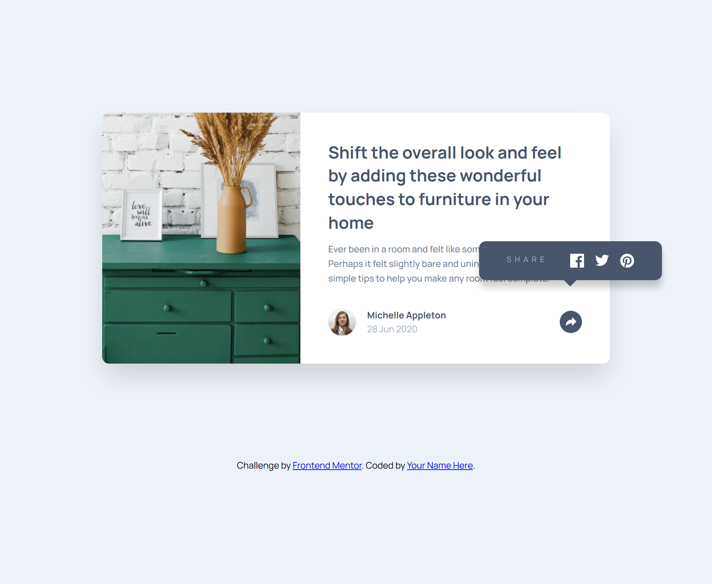
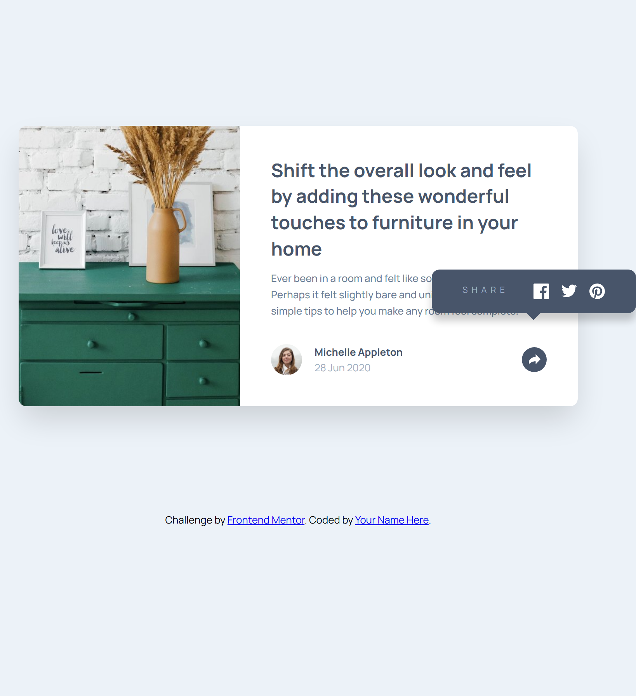
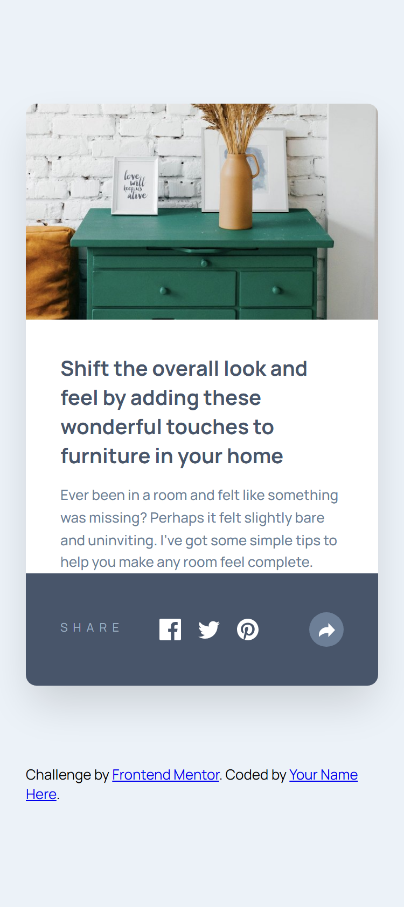

# Frontend Mentor - Article preview component


## Welcome! 👋

This is a solution to the [Article preview component challenge on Frontend Mentor](https://www.frontendmentor.io/challenges/article-preview-component-dYBN_pYFT). Frontend Mentor challenges help you improve your coding skills by building realistic projects.

## Table of contents

- [Overview](#overview)
  - [The challenge](#the-challenge)
  - [Screenshot](#screenshot)
  - [Links](#links)
- [My process](#my-process)
  - [Built with](#built-with)
  - [What I learned](#what-i-learned)
- [Author](#author)

## Overview

### The challenge

Users should be able to:

- View the optimal layout for the component depending on their device's screen size
- See the social media share links when they click the share icon

## 📸 Screenshots

| Desktop                          | Tablet                         | Mobile               |
| -------------------------------- | ------------------------------ | -------------------- |
|  |  |  |

_(Replace these with your actual project screenshots)_

---

### Links

- Solution URL: [Frontend Mentor Solution](https://www.frontendmentor.io/solutions/article-preview-component-master-ZxWoPbH6Zm)
- Live Site URL: [GitHub Pages](https://emelinur.github.io/article-preview-component-master/)

## My process

### Built with

- Semantic HTML5 markup
- CSS Custom Properties
- Flexbox & CSS Grid
- Mobile-first workflow
- Vanilla JavaScript (DOM Manipulation)

### What I learned

Through this project, I gained significant experience in **CSS Positioning** and **JavaScript State Management**. I also reinforced my responsive design skills by using Grid and Flexbox layouts together effectively.

Here are my key takeaways:

1. **CSS Position & Z-index Logic:**
   I learned how to manage the relationship between `absolute` and `relative` positioning to place the popup window correctly over the button. I also mastered the `z-index` ("layering") logic to control the stacking order of elements.

   ```css
   /* Set the boundary for the parent element */
   .card__footer {
     position: relative;
     z-index: 1;
   }

   /* Position the popup freely relative to the parent */
   .share-popover {
     position: absolute;
     top: -80px;
     right: -65px;
     z-index: 10; /* Ensure it stays on top */
   }